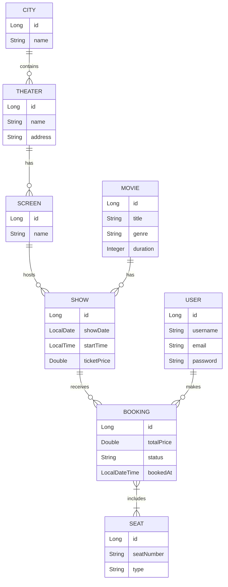
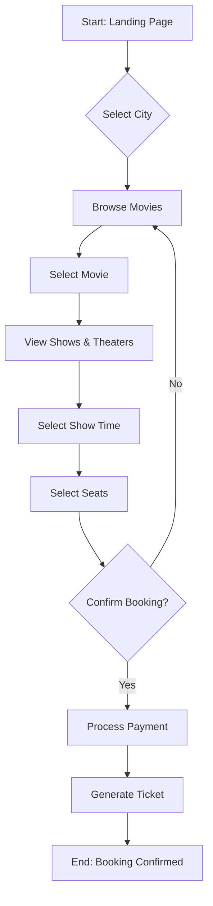

# BookMyShow - Movie Ticket Booking System

A full-stack movie ticket booking application inspired by BookMyShow. This project features a Spring Boot backend with a PostgreSQL database and a responsive HTML/CSS/JS frontend.

---

## 🚀 Features

- **User Authentication**: Register and login as a user.
- **City-based Browsing**: Find theaters and movies in your specific city.
- **Movie Details**: View movie info and showtimes.
- **Seat Selection**: Interactive seat selection for shows.
- **Real-time Booking**: Seamlessly book tickets for movies.
- **Admin Management**: Manage cities, theaters, screens, and shows (via API).

---

## 🛠️ Technology Stack

**Backend:**
- Java 17+
- Spring Boot 3.x
- Spring Data JPA
- PostgreSQL
- Lombok
- Maven

**Frontend:**
- HTML5 & CSS3
- JavaScript (Vanilla)
- Google Fonts (Inter)

---

## 📁 Workspace Folder Structure

```text
BOOKMYSHOW/
├── src/main/java/com/cfs/BMS/
│   ├── config/          # CORS and app configurations
│   ├── controller/      # REST API Endpoints
│   ├── dto/             # Data Transfer Objects (Requests/Responses)
│   ├── entity/          # Database Models (JPA Entities)
│   ├── enums/           # Enumerations (BookingStatus, SeatType)
│   ├── exception/       # Global Exception Handling
│   ├── repository/      # Spring Data Repositories
│   ├── service/         # Business Logic Layer
│   └── BmsApplication.java
├── src/main/resources/
│   ├── application.properties # Configuration (DB, Port)
│   ├── BMS.sql                # Database Schema
│   └── data.sql               # Seed Data
├── UI/UI/
│   ├── css/             # Stylesheets
│   ├── js/              # API and Utility scripts
│   ├── pages/           # HTML templates (Admin, Login, Movies, etc.)
│   └── index.html       # Landing Page
└── pom.xml              # Maven Dependencies
```

---

## 📊 Entity Relationship (ER) Diagram

The following diagram illustrates the database schema and relationships between entities.



---

## 🔄 Booking Flowchart

The logic flow of a user booking a ticket from landing to confirmation.



---

## ⚙️ Setup Instructions

### Backend (Spring Boot)
1. Ensure **PostgreSQL** is running.
2. Create a database named `BMS`.
3. Update `src/main/resources/application.properties` with your PostgreSQL username and password.
4. Run the application:
   ```bash
   mvn spring-boot:run
   ```

### Frontend
1. The frontend resides in the `UI/UI` folder.
2. Open `UI/UI/index.html` in any modern web browser or use a Live Server.
3. Ensure the backend is running on `http://localhost:8080` for API calls to work.

### 🐳 Docker (Optional)
Run the application using Docker:
1. Build the image:
   ```bash
   docker build -t bms-backend .
   ```
2. Run the container:
   ```bash
   docker run -p 8080:8080 bms-backend
   ```
   *Note: Ensure your PostgreSQL instance is accessible from the container.*

---

## 📖 Swagger API Documentation

This project uses **SpringDoc OpenAPI** (Swagger) to provide a comprehensive, interactive API reference. You can test all backend endpoints directly from your browser.

### Accessing Swagger UI:
1. Start the backend application.
2. Navigate to: [http://localhost:8080/swagger-ui/index.html](http://localhost:8080/swagger-ui/index.html)
3. Explore the interactive documentation and try out API requests.

### OpenAPI JSON:
- JSON format: [http://localhost:8080/v3/api-docs](http://localhost:8080/v3/api-docs)

---

## 🌐 API Reference

### 👤 User Endpoints
| Method | Endpoint | Description |
| :--- | :--- | :--- |
| `POST` | `/api/users/register` | Register a new user |
| `POST` | `/api/users/login` | User authentication |
| `GET` | `/api/users` | List all registered users |
| `GET` | `/api/users/{id}` | Get user details by ID |

### 🏙️ City Endpoints
| Method | Endpoint | Description |
| :--- | :--- | :--- |
| `GET` | `/api/cities` | List all cities |
| `GET` | `/api/cities/{id}` | Get city details by ID |

### 🎬 Movie Endpoints
| Method | Endpoint | Description |
| :--- | :--- | :--- |
| `GET` | `/api/movies` | List all movies |
| `GET` | `/api/movies/{id}` | Get movie details by ID |
| `GET` | `/api/movies/search?title=...` | Search movies by title |
| `GET` | `/api/movies/genre/{genre}` | Filter movies by genre |
| `GET` | `/api/movies/genre/{language}` | Filter movies by language |

### 🎭 Theater Endpoints
| Method | Endpoint | Description |
| :--- | :--- | :--- |
| `GET` | `/api/theaters` | List all theaters |
| `GET` | `/api/theaters/{id}` | Get theater details by ID |
| `GET` | `/api/theaters/city/{cityId}` | Get theaters in a specific city |

### 🖥️ Screen Endpoints
| Method | Endpoint | Description |
| :--- | :--- | :--- |
| `GET` | `/api/screens` | List all screens |
| `GET` | `/api/screens/{id}` | Get screen details by ID |
| `GET` | `/api/screens/theater/{theaterId}` | Get screens in a specific theater |

### 📅 Show Endpoints
| Method | Endpoint | Description |
| :--- | :--- | :--- |
| `GET` | `/api/shows` | List all shows |
| `GET` | `/api/shows/{id}` | Get show details by ID |
| `GET` | `/api/shows/movie/{movieId}` | Get shows for a specific movie |
| `GET` | `/api/shows/movie/{movieId}/date?date={YYYY-MM-DD}` | Get shows for a movie on a specific date |

### 💺 Seat Endpoints
| Method | Endpoint | Description |
| :--- | :--- | :--- |
| `GET` | `/api/seats/screen/{screenId}` | Get all seats for a specific screen |
| `GET` | `/api/seats/{id}` | Get seat details by ID |

### 🎟️ Booking Endpoints
| Method | Endpoint | Description |
| :--- | :--- | :--- |
| `POST` | `/api/bookings` | Create a new movie booking |
| `GET` | `/api/bookings/{id}` | Get booking details |
| `GET` | `/api/bookings/user/{userId}` | Get all bookings for a user |
| `PUT` | `/api/bookings/{id}/cancel` | Cancel an existing booking |
| `GET` | `/api/bookings/show/{showId}/available-seats` | Get available seats for a show |

---

Developed with ❤️ by the Project Team.
