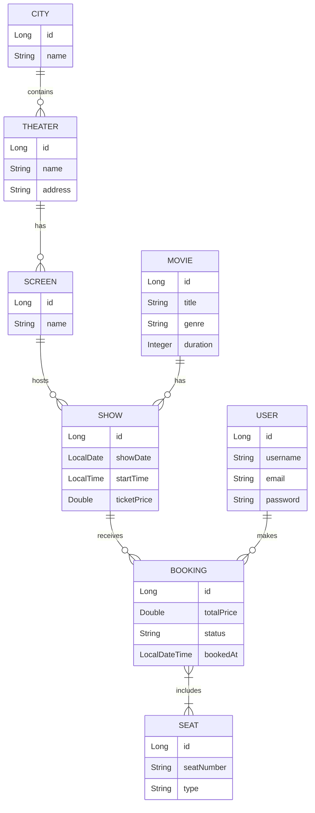
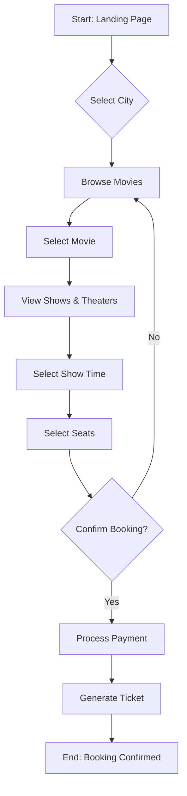

# BookMyShow - Movie Ticket Booking System

A full-stack movie ticket booking application inspired by BookMyShow. This project features a Spring Boot backend with a PostgreSQL database and a responsive HTML/CSS/JS frontend.

---

## 🚀 Features

- **User Authentication**: Register and login as a user.
- **City-based Browsing**: Find theaters and movies in your specific city.
- **Movie Details**: View movie info and showtimes.
- **Seat Selection**: Interactive seat selection for shows.
- **Real-time Booking**: Seamlessly book tickets for movies.
- **Admin Management**: Manage cities, theaters, screens, and shows (via API).

---

## 🛠️ Technology Stack

**Backend:**
- Java 17+
- Spring Boot 3.x
- Spring Data JPA
- PostgreSQL
- Lombok
- Maven

**Frontend:**
- HTML5 & CSS3
- JavaScript (Vanilla)
- Google Fonts (Inter)

---

## 📁 Workspace Folder Structure

```text
BOOKMYSHOW/
├── src/main/java/com/cfs/BMS/
│   ├── config/          # CORS and app configurations
│   ├── controller/      # REST API Endpoints
│   ├── dto/             # Data Transfer Objects (Requests/Responses)
│   ├── entity/          # Database Models (JPA Entities)
│   ├── enums/           # Enumerations (BookingStatus, SeatType)
│   ├── exception/       # Global Exception Handling
│   ├── repository/      # Spring Data Repositories
│   ├── service/         # Business Logic Layer
│   └── BmsApplication.java
├── src/main/resources/
│   ├── application.properties # Configuration (DB, Port)
│   ├── BMS.sql                # Database Schema
│   └── data.sql               # Seed Data
├── UI/UI/
│   ├── css/             # Stylesheets
│   ├── js/              # API and Utility scripts
│   ├── pages/           # HTML templates (Admin, Login, Movies, etc.)
│   └── index.html       # Landing Page
└── pom.xml              # Maven Dependencies
```

---

## 📊 Entity Relationship (ER) Diagram

The following diagram illustrates the database schema and relationships between entities.



---

## 🔄 Booking Flowchart

The logic flow of a user booking a ticket from landing to confirmation.



---

## ⚙️ Setup Instructions

### Backend (Spring Boot)
1. Ensure **PostgreSQL** is running.
2. Create a database named `BMS`.
3. Update `src/main/resources/application.properties` with your PostgreSQL username and password.
4. Run the application:
   ```bash
   mvn spring-boot:run
   ```

### Frontend
1. The frontend resides in the `UI/UI` folder.
2. Open `UI/UI/index.html` in any modern web browser or use a Live Server.
3. Ensure the backend is running on `http://localhost:8080` for API calls to work.

---

## 🌐 API Endpoints (Brief Overview)

- `GET /api/movies`: List all movies.
- `GET /api/cities`: List all cities.
- `GET /api/theaters/city/{cityId}`: Get theaters in a city.
- `POST /api/bookings`: Create a new booking.
- `POST /api/users/login`: User authentication.

---

Developed with ❤️ by the Project Team.
