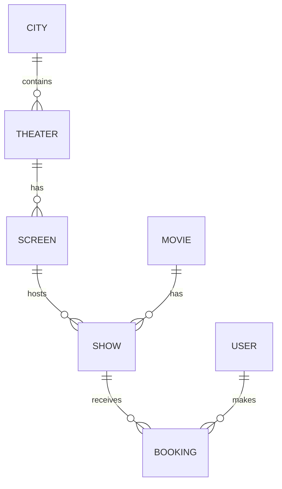

# 🎬 BookMyShow - Advanced Movie Ticket Booking System

[](https://spring.io/projects/spring-boot)
[](https://react.dev/)
[](https://www.typescriptlang.org/)
[](https://www.postgresql.org/)

A full-stack, enterprise-grade movie ticket booking application inspired by BookMyShow. This project features a robust Spring Boot backend and a high-performance, premium React frontend designed with modern aesthetics (Glassmorphism, Dark Mode, and Fluid Animations).

---

## ✨ Premium UI & Features

*   **Modern Aesthetics:** Sleek dark mode interface with glassmorphism effects, backdrop blurs, and premium typography (Inter & Outfit).
*   **Dynamic Discovery:** Hero section with live movie previews, advanced search, and trending stats.
*   **Interactive Booking:** Seamless seat selection grid with real-time feedback and pricing logic.
*   **Performance First:** Built with Vite for ultra-fast HMR and optimized asset loading.
*   **Robust Backend:** Comprehensive REST API with PostgreSQL persistence and automated database seeding.
*   **Developer Experience:** Fully documented with Swagger/OpenAPI and a clean project structure.

---

## 🛠️ Technology Stack

### Backend (Spring Boot Core)
- **Framework:** Spring Boot 3.x
- **Data:** Spring Data JPA + PostgreSQL
- **Security:** CSRF Protection, Password Hashing
- **Documentation:** SpringDoc OpenAPI (Swagger)
- **Utilities:** Lombok, Maven, ModelMapper

### Frontend (Modern React)
- **Library:** React 19 + TypeScript
- **Tooling:** Vite 8.x
- **Animation:** Framer Motion
- **Icons:** Lucide React
- **Styling:** Custom CSS Design System (Vanilla CSS with CSS Variables)
- **Routing:** React Router 7

---

## 📁 Project structure

```text
BOOKMYSHOW/
├── frontend/             # 🎨 Modern React/TypeScript Frontend (Vite)
│   ├── src/
│   │   ├── components/   # Reusable UI components (Navbar, Hero, MovieCard)
│   │   ├── pages/        # Main route pages (Home, MovieDetail, Booking)
│   │   ├── services/     # API integration layer (Axios)
│   │   └── App.tsx       # Main component & routing logic
├── src/main/java/        # ⚙️ Spring Boot Backend (Java)
│   ├── com/cfs/BMS/
│   │   ├── controller/   # REST API Endpoints
│   │   ├── service/      # Business Logic
│   │   ├── entity/       # Database Models
│   │   └── repository/   # Data Access layer
├── src/main/resources/
│   ├── application.properties # PostgreSQL & App config
│   └── data.sql               # Seed data for movies/theaters
└── pom.xml               # Backend dependencies
```

---

## 🚀 Getting Started

### 1. Backend Setup (Spring Boot)
1. Ensure **PostgreSQL** is running.
2. Create a database named `BMS`.
3. Update `src/main/resources/application.properties` with your credentials:
   ```properties
   spring.datasource.url=jdbc:postgresql://localhost:5432/BMS
   spring.datasource.username=your_username
   spring.datasource.password=your_password
   ```
4. Start the backend:
   ```bash
   mvn spring-boot:run
   ```

### 2. Frontend Setup (React)
1. Navigate to the frontend directory:
   ```bash
   cd frontend
   ```
2. Install dependencies:
   ```bash
   npm install
   ```
3. Start the dev server:
   ```bash
   npm run dev
   ```
4. Open [http://localhost:5173](http://localhost:5173) in your browser.

---

## 📊 Business Logic & Workflows

### Entity Relationships
The project follows a relational model mapping Cities → Theaters → Screens → Shows → Bookings.



### Booking Algorithm
A state-of-the-art booking flow ensuring atomicity and seat availability:
1. **Selection:** User selects movie and theater city-wide.
2. **Showtime:** Filtering based on movie availability and theater schedules.
3. **Seat Assignment:** Interactive map displaying available vs occupied seats.
4. **Finalization:** Ticket generation and booking confirmation.

---

## 📖 API Documentation

Explore the interactive API reference via Swagger UI while the backend is running:
🔗 [http://localhost:8080/swagger-ui/index.html](http://localhost:8080/swagger-ui/index.html)

---

Developed with ❤️ by the Project Team. 🚀
